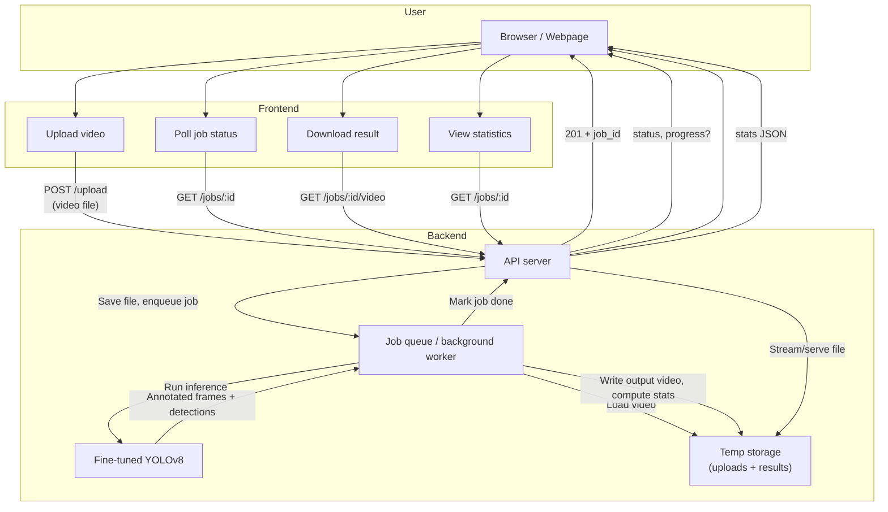

# p-soccer: System Architecture

High-level architecture for the web-based football analysis flow: upload video → backend runs fine-tuned YOLOv8 → user downloads processed video and sees statistics.

---

## Architecture Diagram

---

## Flow Summary

| Step | Actor | Action |
|------|--------|--------|
| 1 | User | Opens webpage, selects video file, submits upload |
| 2 | Frontend | Sends video to backend (e.g. `POST /upload` or `POST /jobs`) |
| 3 | Backend | Stores video, creates a job, starts background processing; returns `job_id` |
| 4 | Frontend | Polls `GET /jobs/:id` until status is `done` (or `failed`) |
| 5 | Backend | Worker loads video, runs fine-tuned YOLOv8, writes annotated video + computes statistics; updates job status |
| 6 | User | Sees “Complete” on webpage; views statistics and clicks to download processed video |
| 7 | Frontend | Requests `GET /jobs/:id/video` (and stats from `GET /jobs/:id`); user downloads file |

---

## Components

- **Frontend**: Single page — upload UI, status/progress, display stats, download link for the processed video.
- **API server**: Handles uploads, job creation, status/stats, and serving the result video.
- **Job queue / worker**: Runs the long-running YOLOv8 pipeline so the API can respond quickly and the frontend can poll.
- **Fine-tuned YOLOv8**: Loaded by the worker; reads video from temp storage, writes annotated video and stats back to storage.
- **Temp storage**: Holds uploaded videos and output videos (and optionally stats) for the lifetime of the job.

---

## Out of scope (for this diagram)

- Training pipeline (Kaggle dataset → fine-tune YOLOv8 → `best.pt`); that remains a separate, offline process whose output is the model used here.
- Auth, multi-tenancy, persistence of jobs beyond a single run (can be added later).
